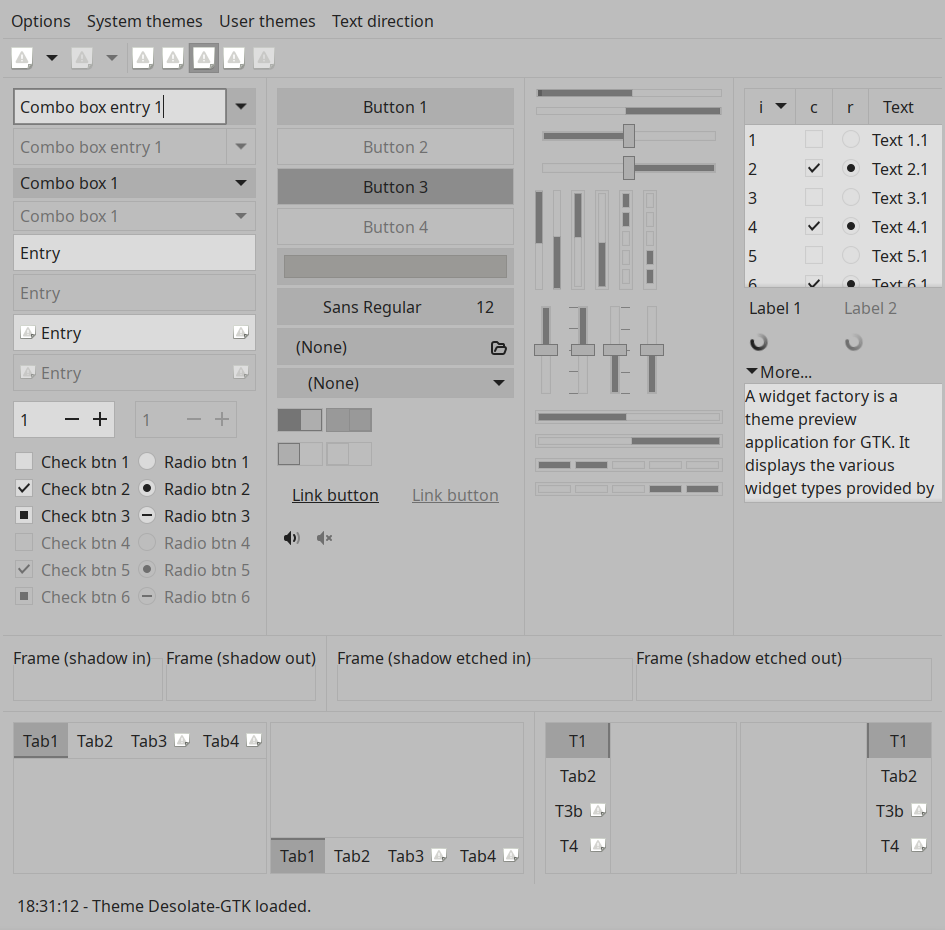
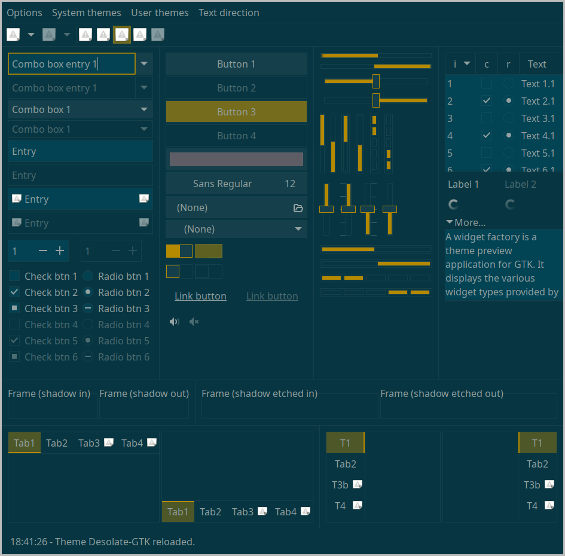

# Desolate GTK

Another customizable not-so-colorful GTK theme for your tiling WM.

This is a variation of [linea-nord-color](https://github.com/deviantfero/wpgtk-templates) theme, which is part of [wpgtk](https://github.com/deviantfero/wpgtk) project.



## Instalation

1. Clone the repository
```sh
cd ~/.themes
git clone https://github.com/He4eT/desolate-GTK.git Desolate
```
2. Apply the theme in any way you like. You can use `lxappearance`, for example.

Additionally, you might need to copy the contents of `~/.config/gtk-3.0/` to `~/.config/gtk-4.0/`, or set the `GTK_THEME` environment variable in your ~/.profile file:
```
export GTK_THEME=Desolate
```

## Customisation

You could change theme colors in `general/gtk-colors.css`:
```
@define-color gtk_base_color #073642;
@define-color gtk_fg_color #93a1a1;
@define-color gtk_selection_color #b58900;
```


## See Also

- [GTK Theming Guide](https://gtkthemingguide.vercel.app/)
- [AWF - A widget factory (extended)](https://github.com/luigifab/awf-extended)
- `GTK_THEME=Desolate-GTK awf-gtk3`

## License

This project is licensed under the GPLv2 License - see the [LICENSE](LICENSE) file for details
